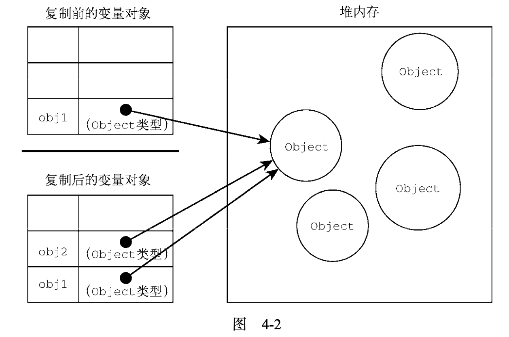

## 原始值与引用值

​	ECMAScript 变量可以包含两种不同类型的数据:**原始值和引用值**。原始值(primitive value)就是**最简单的数据**，引用值(reference value)则是由**多个值构成的对象**。

​	在把一个值赋给变量时，JavaScript 引擎必须确定这个值是原始值还是引用值。上一章讨论了 **6 种原始值**:**Undefined、Null、Boolean、Number、String 和 Symbol**。保存原始值的变量是按值(by value)访问的，因为我们操作的就是存储在变量中的实际值。

​	引用值是**保存在内存中的对象**。与其他语言不同，**JavaScript 不允许直接访问内存位置**，因此也就不能直接操作对象所在的**内存空间**。在操作对象时，实际上操作的是对该**对象的引用**(reference)**而非实际的对象本身**。为此，保存引用值的变量是按引用(by reference)访问的。

> **注意** 在很多语言中，字符串是使用对象表示的，因此被认为是引用类型。ECMAScript 打破了这个惯例。

### 动态属性

​	原始值和引用值的定义方式很类似，都是创建一个变量，然后给它赋一个值。不过，在变量保存了这个值之后，可以对这个值做什么，则大有不同。对于引用值而言，可以随时**添加、修改和删除**其属性和方法。比如，看下面的例子:

```javascript
let person = new Object();
person.name = "Nicholas"; 
console.log(person.name); // "Nicholas"
```

​	这里，首先创建了一个对象，并把它保存在变量 person 中。然后，给这个对象添加了一个名为name 的属性，并给这个属性赋值了一个字符串"Nicholas"。在此之后，就可以访问这个新属性，直到对象被销毁或属性被显式地删除。

​	原始值不能有属性，尽管尝试给原始值添加属性不会报错。比如:

```javascript
let name = "Nicholas";
name.age = 27; 
console.log(name.age); // undefined
```

​	在此，代码想给字符串 name 定义一个 age 属性并给该属性赋值 27。紧接着在下一行，属性不见了。记住，只有**引用值**可以**动态添加**后面可以使用的**属性**。

​	注意，原始类型的初始化可以只使用**原始字面量**形式。如果使用的是 new 关键字，则 JavaScript 会创建一个 Object 类型的实例，但其**行为类似原始值**。下面来看看这两种初始化方式的**差异**:

```javascript
let name1 = "Nicholas";
let name2 = new String("Matt");
name1.age = 27;
name2.age = 26;
console.log(name1.age); // undefined
console.log(name2.age); // 26
console.log(typeof name1); // string
console.log(typeof name2); // object
```

### 复制值

​	除了存储方式不同，原始值和引用值在通过**变量复制**时也有所不同。在通过变量把一个原始值赋值到另一个变量时，原始值会被复制到新变量的位置。请看下面的例子:

```javascript
let num1 = 5;
let num2 = num1;
```

​	这里，num1 包含数值 5。当把 num2 初始化为 num1 时，num2 也会得到数值 5。这个值跟存储在 num1 中的 5 是**完全独**立的，因为它是那个值的**副本**。

​	这两个变量可以独立使用，互不干扰。这个过程如图下所示。

复制前的变量对象：

|      |               |
| :--: | :-----------: |
|      |               |
| Num1 | 5(Number类型) |

---

复制后的变量对象：

|      |               |
| :--: | :-----------: |
| num2 | 5(Number类型) |
| num1 | 5(Number类型) |

​	在把**引用值**从一个变量**赋给**另一个变量时，存储在变量中的值也会被复制到新变量所在的位置。区别在于，这里复制的值**实际**上是一个**指针**，它**指向**存储在**堆内存**中的**对象**。操作完成后，两个变量实际上指向**同一个对象**，因此一个对象上面的变化会在另一个对象上反映出来，如下面的例子所示:

```javascript
let obj1 = new Object();
let obj2 = obj1;
obj1.name = "Nicholas"; 
console.log(obj2.name); // "Nicholas"
```

​	在这个例子中，变量 obj1 保存了一个新对象的实例。然后，这个值被复制到 obj2，此时两个变量都指向了**同一个对象**。在给 obj1 创建属性 name 并赋值后，通过 obj2 也可以访问这个属性，因为它们都指向同一个对象。图 4-2 展示了变量与堆内存中对象之间的关系。



### 传递参数

​	ECMAScript 中所有**函数**的**参数**都是按**值传递**的。这意味着函数外的值会被复制到函数内部的参数中，就像从一个变量复制到另一个变量一样。**如果是原始值，那么就跟原始值变量的复制一样，如果是引用值，那么就跟引用值变量的复制一样。**对很多开发者来说，这一块可能会不好理解，毕竟变量有按值和按引用访问，而**传参**则**只有按值传递**。

​	在按值传递参数时，值会被复制到一个**局部变量**(即一个**命名参数**，或者用 ECMAScript 的话说， 就是**arguments** 对象中的一个槽位)。在按**引用传递参数**时，值在内存中的**位置**会被保存在一个**局部变量**，这意味着对**本地变量**的**修改**会反映到**函数外部**。(这在 ECMAScript 中是不可能的。)来看下面这个例子:

```javascript
function addTen(num) {
  num += 10;
  return num;
}
let count = 20;
let result = addTen(count); 
console.log(count); // 20，没有变化 
console.log(result); // 30
```

​	这里，函数 addTen()有一个参数 num，它其实是一个局部变量。在调用时，变量 count 作为参数传入。count 的值是 20，这个值被复制到参数 num 以便在 addTen()内部使用。在函数内部，参数 num 的值被加上了 10，但这不会影响函数外部的原始变量 count。参数 num 和变量 count **互不干扰**，它们 只不过碰巧保存了一样的值。如果 num 是按引用传递的，那么 count 的值也会被修改为 30。这个事实在使用数值这样的**原始值**时是非常明显的。但是，如果变量中**传递**的是**对象**，就没那么清楚了。比如， 再看这个例子:

```javascript
function setName(obj) { 
	obj.name = "Nicholas";
}
let person = new Object();
setName(person);
console.log(person.name); // "Nicholas"
```

​	这一次，我们创建了一个对象并把它保存在变量 person 中。然后，这个对象被传给 setName() 方法，并被复制到参数 obj 中。在函数内部，obj 和 person 都指向**同一个对象**。结果就是，即使对象是**按值传进函数**的，obj 也会通过**引用访问对象**。当函数内部给 obj 设置了 name 属性时，函数外部的对象也会**反映**这个变化，因为 obj 指向的对象保存在**全局作用域的堆内存**上。很多开发者错误地认为， 当在**局部作用域**中修改对象而变化反映到全局时，就意味着参数是按引用传递的。为**证明对象是按值传递**的，我们再来看看下面这个修改后的例子:

```javascript
function setName(obj) {
  obj.name = "Nicholas";
  obj = new Object();
  obj.name = "Greg";
}
let person = new Object();
setName(person);
console.log(person.name); // "Nicholas"
```

​	这个例子前后唯一的变化就是 setName()中多了两行代码，将 obj 重新定义为一个有着不同 name 的新对象。当 person 传入 setName()时，其 name 属性被设置为"Nicholas"。然后变量 obj 被设置 为一个新对象且 name 属性被设置为"Greg"。如果 person 是**按引用传递**的，那么 person 应该自动将指针改为指向 name 为"Greg"的对象。可是，当我们再次访问 person.name 时，它的值是"Nicholas"， 这表明函数中参数的**值改变之后**，原始的**引用仍然没变**。当 obj 在函数内部被**重写**时，它变成了一个**指向本地对象的指针**。而那个本地对象在函数执行结束时就被**销毁**了。

> **注意** ECMAScript中函数的参数就是**局部变量**。


### 确定类型

​	前一章提到的 typeof 操作符最适合用来**判断**一个**变量**是否为**原始类型**。更确切地说，它是判断一个变量是否为字符串、数值、布尔值或 undefined 的**最好方式**。如果值是对象或 null，那么 typeof返回"object"，如下面的例子所示:

```javascript
let s = "Nicholas";
let b = true;
let i = 22;
let u;
let n = null;
let o = new Object();
console.log(typeof s); // string
console.log(typeof i); // number
console.log(typeof b); // boolean
console.log(typeof u); // undefined
console.log(typeof n); // object
console.log(typeof o); // object
```

​	typeof 虽然对**原始值**很有用，但它对**引用值**的用处不大。我们通常不关心一个值是不是对象， 而是想知道它是什么**类型**的对象。为了解决这个问题，ECMAScript 提供了 **instanceof** 操作符，语 法如下:

```javascript
result = variable instanceof constructor
```

​	如果变量是给定**引用类型**(由其**原型链**决定，将在第 8 章详细介绍)的实例，则 instanceof 操作符返回 true。来看下面的例子:

```javascript
console.log(person instanceof Object); //变量person是Object吗?
console.log(colors instanceof Array); // 变量 colors 是 Array 吗?
console.log(pattern instanceof RegExp); // 变量 pattern 是 RegExp 吗?
```

​	按照定义，所有**引用值**都是 **Object** 的实例，因此通过 instanceof 操作符检测任何引用值和 Object 构造函数都会返回 true。类似地，如果用 instanceof **检测原始值**，则**始终**会返回 **false**， 因为原始值不是对象。

> **注意** typeof操作符在用于检测函数时也会返回"function"。当在Safari(直到Safari5) 和 Chrome(直到 Chrome 7)中用于检测正则表达式时，由于实现细节的原因，typeof 也会返回"function"。ECMA-262 规定，任何实现内部**[[Call]]方法**的对象都应该在 typeof 检测时返回"function"。因为上述浏览器中的**正则表达式实现了这个方法**，所 以 typeof 对正则表达式也**返回"function"**。在 **IE 和 Firefox** 中，typeof 对正则表达式 返回"object"。

