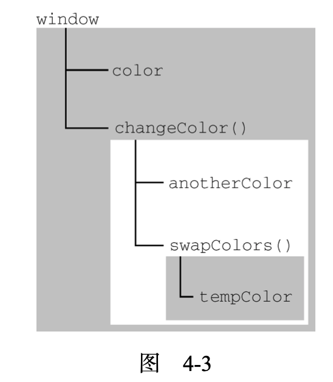

## 执行上下文与作用域

​	执行上下文(以下简称“上下文”)的概念在 JavaScript 中是颇为重要的。**变量或函数**的**上下文**决定了它们可以访问哪些**数据**，以及它们的行为。每个上下文都有一个**关联的变量对象**(variable object)， 而这个上下文中定义的所有变量和函数都**存在于**这个对象上。虽然**无法通过代码访问变量对象**，但后台**处理数据**会用到它。

​	**全局上下文**是**最外层**的上下文。根据 ECMAScript 实现的**宿主环境**，表示全局上下文的对象**可能不一样**。在**浏览器**中，全局上下文就是我们常说的 **window** 对象(第 12 章会详细介绍)，因此所有通过 **var 定义**的**全局变量和函数**都会成为 **window** 对象的**属性和方法**。使用 **let 和 const 的顶级声明不会定义在全局上下文中**，但在**作用域链解析**上效果是**一样**的。上下文在其**所有代码**都**执行完毕**后会被**销毁**，包括定义在它上面的所有**变量和函数**(全局上下文在应用程序退出前才会被销毁，比如**关闭网页或退出浏览器**)。

​	每个函数调用都有自己的上下文。当代码执行流进入函数时，函数的上下文被推到一个**上下文栈**上。 在函数执行完之后，上下文栈会**弹出**该函数上下文，将**控制权**返还给**之前的执行上下文**。ECMAScript **程序的执行流**就是通过这个**上下文栈**进行控制的。

​	上下文中的代码在执行的时候，会创建变量对象的一个**作用域链**(scope chain)。这个作用域链**决定**了各级上下文中的代码在访问变量和函数时的**顺序**。代码**正在执行**的上下文的**变量对象**始终位于作用域链的**最前端**。如果上下文是函数，则其**活动对象**(activation object)用作**变量对象**。活动对象**最初**只有 一个定义变量:**arguments**。(**全局上下文中没有这个变量**。)作用域链中的下一个变量对象来自包含上下文，再下一个对象来自再下一个包含上下文。以此类推直至全局上下文;**全局上下文的变量对象**始终是作用域链的**最后一个变量对象**。

​	代码执行时的**标识符解析**是通过沿**作用域链逐级搜索**标识符名称完成的。搜索过程始终从作用域链的**最前端**开始，然后**逐级往后**，直到找到标识符。(如果没有找到标识符，那么通常会报错。)

​	看一看下面这个例子:

```javascript
var color = "blue";
function changeColor() {
  if (color === "blue") {
    color = "red";
  } else {
    color = "blue";
  }
}
changeColor();
```

​	对这个例子而言，函数 changeColor()的**作用域链**包含两个对象:一个是它**自己的变量对象**(就是定义 arguments 对象的那个)，另一个是**全局上下文的变量对象**。这个函数内部之所以能够访问变量 color，就是因为可以在**作用域链中**找到它。

​	此外，**局部作用域**中定义的变量可用于在局部上下文中**替换全局变量**。看一看下面这个例子:

```javascript
var color = "blue";
function changeColor() {
  let anotherColor = "red";
  function swapColors() {
    let tempColor = anotherColor;
    anotherColor = color;
    color = tempColor;
    // 这里可以访问color、anotherColor和tempColor
  }
  // 这里可以访问color和anotherColor，但访问不到tempColor
  swapColors();
}
// 这里只能访问color
changeColor();
```

​	以上代码涉及 3 个上下文:全局上下文、changeColor()的局部上下文和 swapColors()的局部 上下文。全局上下文中有一个变量 color 和一个函数 changeColor()。changeColor()的局部上下文中 有一个变量 anotherColor 和一个函数 swapColors()，但在这里可以访问全局上下文中的变量 color。 swapColors()的局部上下文中有一个变量 tempColor，只能在这个上下文中访问到。全局上下文和 changeColor()的局部上下文都无法访问到 tempColor。而在 swapColors()中则可以访问另外两个 上下文中的变量，因为它们都是父上下文。图 4-3 展示了前面这个例子的作用域链。



​	图 4-3 中的矩形表示不同的上下文。**内部上下文**可以通过**作用域链**访问**外部上下文中的一切**，但外部上下文**无法访问内部上下文**中的任何东西。上下文之间的连接是**线性的、有序的**。每个上下文都可以到上一级上下文中去搜索变量和函数，但任何上下文都**不能**到**下一级上下文**中去搜索。swapColors() 局部上下文的作用域链中有 3 个对象:swapColors()的变量对象、changeColor()的变量对象和全局变量对象。swapColors()的局部上下文首先从自己的变量对象开始搜索变量和函数，搜不到就去搜索 上一级变量对象。changeColor()上下文的作用域链中只有 2 个对象:它自己的变量对象和全局变量对象。因此，它不能访问 swapColors()的上下文。

> **注意** 函数参数被认为是当前上下文中的变量，因此也跟上下文中的其他变量**遵循相同**的访问规则。


### 作用域链增强

​	虽然执行上下文主要有**全局上下文和函数上下文**两种(eval()调用内部存在第三种上下文)，但有其他方式来增强作用域链。某些语句会导致在作用域链前端**临时添加**一个**上下文**，这个上下文在代码执行后会被**删除**。通常在两种情况下会出现这个现象，即代码执行到下面任意一种情况时:

- try/catch 语句的 **catch 块**
- with 语句

​	这两种情况下，都会在作用域链前端添加一个变量对象。对 with 语句来说，会向作用域链前端**添加指定的对象**;对 catch 语句而言，则会**创建一个新的变量对象**，这个变量对象会包含要**抛出的错误对象的声明**。看下面的例子:

```
function buildUrl() {
      let qs = "?debug=true";
      with(location){
        let url = href + qs;
}
return url; }
```

​	这里，with 语句将 location 对象作为上下文，因此 location 会被添加到作用域链前端。 buildUrl()函数中定义了一个变量 qs。当 with 语句中的代码引用变量 href 时，实际上引用的是 location.href，也就是自己变量对象的属性。在引用 qs 时，引用的则是定义在 buildUrl()中的那个变量，它定义在函数上下文的变量对象上。而在 with 语句中使用 var 声明的变量 url 会成为函数上下文的一部分，可以作为函数的值被返回;但像这里使用let声明的变量url，因为被限制在**块级作用域**(稍后介绍)，所以在 with 块之外没有定义。

> **注意** IE的实现在**IE8之前**是有偏差的，即它们会将**catch语句中捕获的错误**添加到执行上下文的变量对象上，而不是 catch 语句的变量对象上，导致在 catch 块**外部都可以访问**到错误。**IE9** 纠正了这个问题。


### 变量声明

​	ES6 之后，JavaScript 的变量声明经历了翻天覆地的变化。直到 **ECMAScript 5.1**，var 都是声明变量的**唯一**关键字。ES6 不仅增加了 let 和 const 两个关键字，而且还让这两个关键字压倒性地**超越 var** 成为首选。

#### 使用 **var** 的函数作用域声明

​	在使用 var 声明变量时，变量会被自动添加到**最接近的上下文**。在函数中，最接近的上下文就是函数的局部上下文。在 with 语句中，最接近的上下文也是函数上下文。如果变量**未经声明**就被**初始化**了， 那么它就会自动被添加到**全局上下文**，如下面的例子所示:

```javascript
function add(num1, num2) {
  var sum = num1 + num2;
  return sum;
}
let result = add(10, 20); // 30
console.log(sum); // 报错:sum 在这里不是有效变量
```

​	这里，函数 add()定义了一个**局部变量** sum，保存加法操作的结果。这个值作为函数的值被返回， 但变量 sum 在函数外部是访问不到的。如果**省略**上面例子中的**关键字 var**，那么 sum 在 add()被调用之后就变成可以访问的了，如下所示:

```javascript
function add(num1, num2) {
  sum = num1 + num2;
  return sum;
}
let result = add(10, 20); // 30 console.log(sum); // 30
```

​	这一次，变量 sum 被用加法操作的结果初始化时并**没有使用 var 声明**。在调用 add()之后，sum被**添加到了全局上下文**，在函数**退出**之后**依然存在**，从而在后面可以访问到。

> **注意** 未经声明而初始化变量是JavaScript编程中一个**非常常见的错误**，会导致很多问题。 为此，读者在初始化变量之前**一定要先声明变量**。在**严格模式**下，未经声明就初始化变量会**报错**。

​	var 声明会被拿到函数或全局作用域的**顶部**，位于作用域中所有代码之前。这个现象叫作“**提升**” (hoisting)。提升让**同一作用域**中的代码**不必考虑变量是否已经声明**就可以**直接使用**。可是在实践中，提升也会导致**合法却奇怪**的现象，即在变量声明之前使用变量。下面的例子展示了在全局作用域中两段等价的代码:

```javascript
var myName = "Jake";
// 等价于:
var myName;
myName = "Jake";
//下面是两个等价的函数:
function fn1() {
  var myName = "Jake";
}
// 等价于:
function fn2() {
  var myName;
  myName = "Jake";
}
//通过在声明之前打印变量，可以验证变量会被提升。声明的提升意味着会输出 undefined 而不是 Reference Error:
console.log(myName); // undefined
var myName = "Jake";
function fn3() {
  console.log(myName); // undefined
  var myName = "Jake";
}
```

#### 使用 **let** 的块级作用域声明

​	ES6 新增的 let 关键字跟 var 很相似，但它的**作用域**是**块级**的，这也是 JavaScript 中的新概念。块级作用域由最近的一对**包含花括号{}**界定。换句话说，if 块、while 块、function 块，甚至连**单独的块**也是 let 声明变量的作用域。

```javascript
if (true) {
  let a;
}
console.log(a); // ReferenceError: a 没有定义
while (true) {
  let b;
}
console.log(b); // ReferenceError: b 没有定义
function foo() {
  let c;
}
console.log(c); // ReferenceError: c 没有定义
// 这没什么可奇怪的
// var 声明也会导致报错
// 这不是对象字面量，而是一个独立的块
// JavaScript 解释器会根据其中内容识别出它来
{
  let d;
}
console.log(d); // ReferenceError: d 没有定义

```

​	let 与 var 的另一个不同之处是在同一作用域内**不能声明两次**。重复的 var 声明会被**忽略**，而重复的 let 声明会**抛出 SyntaxError**。

```javascript
var a;
var a;
// 不会报错
{
  let b;
  let b;
}
// SyntaxError: 标识符 b 已经声明过了
```

​	let 的行为非常适合在**循环中声明**迭代变量。使用 var 声明的**迭代变量**会**泄漏**到**循环外部**，这种情况应该避免。来看下面两个例子:

```javascript
for (var i = 0; i < 10; ++i) {}
console.log(i); // 10
for (let j = 0; j < 10; ++j) {}
console.log(j); // ReferenceError: j 没有定义
```

​	严格来讲，let 在 JavaScript 运行时中**也会被提升**，但由于“**暂时性死区**”(temporal dead zone)的 缘故，实际上不能在声明之前使用 let 变量。因此，从写 JavaScript 代码的角度说，let 的提升跟 var 是不一样的。

#### 使用 **const** 的常量声明

​	除了 let，ES6 同时还增加了 const 关键字。使用 const 声明的变量必须**同时初始化**为某个值。 一经声明，在其生命周期的任何时候都**不能再重新赋予新值**。

```javascript
const a; // SyntaxError: 常量声明时没有初始化
const b = 3;
console.log(b); // 3
b = 4; // TypeError: 给常量赋值
```

​	const 除了要遵循以上规则，其他方面与 let 声明是一样的:

```javascript
f (true) {
      const a = 0;
}
console.log(a); // ReferenceError: a 没有定义
while (true) {
  const b = 1;
}
console.log(b); // ReferenceError: b 没有定义
function foo() {
  const c = 2;
}
console.log(c); // ReferenceError: c 没有定义
{
	const d = 3;
}
console.log(d); // ReferenceError: d 没有定义
```

​	const 声明只应用到**顶级原语**或者对象。换句话说，赋值为对象的 const 变量不能再被重新赋值为其他**引用值**，但**对象的键**则**不受限制**。

```javascript
const o1 = {};
o1 = {}; // TypeError: 给常量赋值
const o2 = {};
o2.name = 'Jake';
console.log(o2.name); // 'Jake'
```

​	如果想让整个对象都不能修改，可以使用 **Object.freeze()**，这样再给属性赋值时虽然不会报错， 但会静默失败:

```
const o3 = Object.freeze({}); 
o3.name = 'Jake'; 
console.log(o3.name); // undefined
```

​	由于 const 声明暗示变量的值是**单一类型且不可修改**，JavaScript 运行时**编译器**可以将其所有实例都替换成实际的值，而不会通过**查询表**进行变量查找。谷歌的 V8 引擎就执行这种优化。

> **注意** 开发实践表明，如果开发流程并不会因此而受很大影响，就应该尽**可能地多使用 const 声明**，除非确实需要一个**将来会重新赋值**的变量。这样可以从根本上保证**提前发现**重新赋值导致的 **bug**。

#### 标识符查找

​	当在特定上下文中为**读取或写入**而引用一个标识符时，必须通过**搜索确定**这个标识符表示什么。搜索**开始**于作用**域链前端**，以给定的名称搜索对应的标识符。如果在**局部上下文**中找到该标识符，则搜索停止，变量确定;如果没有找到变量名，则继续沿**作用域链搜索**。(注意，**作用域链**中的对象也有一个原型链，因此搜索**可能涉及每个对象的原型链**。)这个过程一直持续到搜索至**全局上下文**的变量对象。 如果仍然没有找到标识符，则说明其**未声明**。

​	为更好地说明标识符查找，我们来看一个例子:

```javascript
var color = "blue";
function getColor() {
  return color;
}
console.log(getColor()); // 'blue'
```

​	在这个例子中，调用函数 getColor()时会引用变量 color。为确定 color 的值会进行**两步搜索**。 第一步，搜索 getColor()的变量对象，查找名为 color 的标识符。结果没找到，于是继续搜索下一个变量对象(来自全局上下文)，然后就找到了名为 color 的标识符。因为全局变量对象上有 color 的定义，所以搜索结束。

​	对这个搜索过程而言，**引用局部变量**会让搜索自动**停止**，而**不继续搜索下一级变量对象**。也就是说， 如果局部上下文中有一个**同名的标识符**，那就**不能**在该上下文中**引用父上下文**中的**同名标识符**，如下面 的例子所示:

```javascript
var color = "blue";
function getColor() {
  let color = "red";
  {
    let color = "green";
    return color;
  }
}
console.log(getColor()); // 'green'
```

​	在这个修改后的例子中，getColor()内部声明了一个名为 color 的局部变量。在调用这个函数时， 变量会被声明。在执行到函数返回语句时，代码引用了变量 color。于是开始在局部上下文中搜索这个 标识符，结果找到了值为'green'的变量 color。因为变量已找到，搜索随即停止，所以就使用这个局部变量。这意味着函数会返回'green'。**在局部变量 color 声明之后的任何代码都无法访问全局变量 color，除非使用完全限定的写法 window.color**。

> **注意** 标识符查找**并非没有代价**。**访问局部变量比访问全局变量要快**，因为**不用切换作用域**。不过，JavaScript 引擎在**优化标识符查找**上做了很多工作，**将来这个差异可能就微不足道**了。


